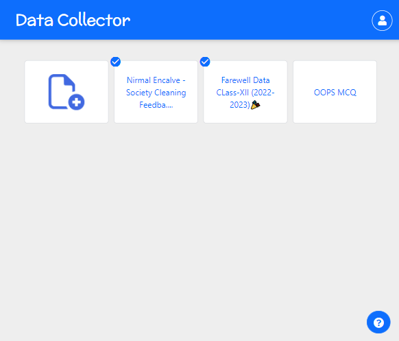
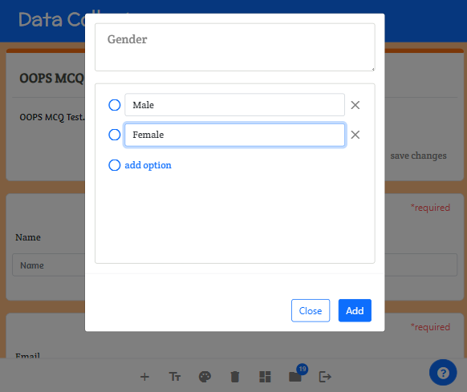
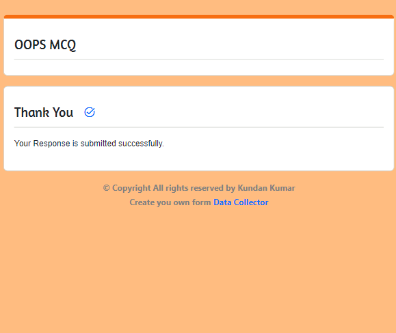

# Data Collector

* UI developed using <b>Html, Css and Bootstrap</b>.
* <b>Nodejs</b> is used to develop backend of the website.
* Added functionalities using <b>JS</b>.
* <b>MongoDB</b> is used for data storage.
* You can check it here: <a href="https://alert-sparrow.cyclic.app/">Data Collector</a>.
* <b>Currently Website is in Test Mode, you don't need to Login to test it.</b>
 
 
 
 
 
# Features

* Realtime data collection can be done.
* Having responsive UI.
* You can login via credentials or <b>OAuth using google</b>.
* Create your form and share it with anyone.
* You can add mcq and short text questions.

# Teck-Stack Used :
- Node
- Express
- MongoDB
- HTML
- CSS
- Js
- Bootstrap

# Schema Design

 
 # How To Use It With Screenshots
 
 ## I. Home
 - Click on Go To Forms Button
 

## II. Dashboard
 - On Dashboard You Can Create New Form or Open An Existing Form To Modify It
 

## III. Manage Form
 - Here You Can Edit Title/Description, Click On Title And Start Typing, You Will See Save Changes Button
 - Edit Theme Of Form
 - Add/Modify Questions
 - Delete Questions/Form
 - Navigate To Responses
 
 
 

## IV. Make Form Live/Stop
 - Toogle The Button On Page To Make Your Form Live
 - Once You Make Your Form Live, You Will Get A URL That You Can Share With Anyone
 - Below Page You Can See Responses That You Got On Your Form
 
 

# IV. Share The URL Of Form With Anyone To Fill And Submit It
 

Ask a question or give me a shout out:

- 💌 https://kundan-6646.github.io/Portfolio/
- 🐣 https://www.linkedin.com/in/kundan-kmr/